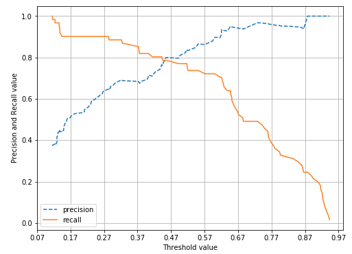
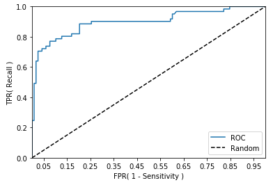

Chapter03 : 평가
=====
## Accuracy
 - 예측 결과가 동일한 데이터 건수 / 전체 예측 데이터 건수
 - imbalanced label 값 분포에서는 Accuracy만으로 성능을 측정하는 경우 적합하지 않다.
 -----
 ## Confusion Matrix
 - **학습된 분류 모델이 예측을 수행하면서 얼마나 헷갈리고 있는지도 함께 보여주는 지표**
 - 이진 분류의 예측 오류가 얼마인지와 더불러 어떠한 유형의 예측 오류가 발생하고 있는지를 함께 나타낸다.
 - row : 실제 클래스(Actual Class), column : 예측 클래스(Predicted Class)

    |                | Negative(0)                | Positive(1)                |
    |----------------|----------------------------|----------------------------|
    | Negative(0)    | TN(True Negative)          | FP(False Positive)         |
    | Positive(1)    | FN(False Negative)         | TP(True Positive)          |
 - 정확도는 다음과 같이 재정의 될 수 있다.
 - 정확도 = 예측 결과와 실제 값이 동일한 건수 / 전체 데이터 수 = (TN + TP) / (TN + FP + FN + TP)
 - 값을 조합해 Classifier의 성능을 측정할 수 있는 여러 주요지표를 계산할 수 있다.
 -----
 ## 정밀도와 재현율(Precision and Recall)
 - 정밀도 = TP / (FP + TP)
    - 예측을 Positive로 한 대상 중에 예측과 실제값이 Positive로 일치한 데이터의 비율
 - 재현율 = TP / (FN + TP)
    - 실제 값이 Positive인 대상 중에 예측과 실제 값이 Positive로 일치한 데이터의 비율
 - 재현율이 상대적으로 더 중요한 지표인 경우는 실제 Positive 양성인 데이터 에측을 Negative로 잘못 판단하게 되면 업무상 큰 영향이 발생하는 경우
 - 정밀도가 상대적으로 더 중요한 지표인 경우는 실제 Negative 음성인 데이터 예측을 Positive 양성으로 잘못 판단하게 되면 업무상 큰 영향이 발생하는 경우
 - Precision/Recall Trade-off
    - 상호보완적인 평가 지표이기 때문에 어느 한쪽을 높이면 다른 하나의 수치는 떨어지기 쉽다.
    - 
 -----
 ## F1 score
  - 정밀도와 재현율을 결합한 지표로 어느 한쪽으로 치우치지 않는 수치를 나타낼 때 상대적으로 높은 값을 가진다.
  - F1 = 2 * (precision * recall) / (precision + recall)
 -----
 ## ROC curve and AUC
 - 이진 분류의 예측 성능 측정에서 중요하게 상요되는 지표
 - ROC curve : FPR이 변할 때 TPR이 어떻게 변하는지 나타내는 곡선
    - TPR(민감도) : 실제값 Positive가 정확히 예측돼야 하는 수준
        - TP / (FN + TP)
    - TNR(특이성) : 실제값 Negative가 정확히 예측돼야 하는 수준
        - TN / (FP + TN)
    - FPR = 1 - TNR
- 일반적으로 ROC curve 자체는 FPR과 TPR의 변화값을 보는 데 이용하며 분류의 성능 지표로 사용된느 것은 ROC 곡선 면적에 기반한 AUC값으로 결정한다.
- `AUC가 높아지려면 FPR이 작은 상태에서 얼마나 큰 TPR을 얻을 수 있는가가 관건이다.`
- 
-----
## 피마 인디언 당뇨병 예측 
- [4_pima_indians_diabetes.py](https://github.com/vim-hjk/machine-learning-study/blob/main/ch03/4_pima_indians_diabetes.py) 참고

    
    