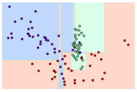

Chapter04 : 분류 - part1
=====
## Overview
 - **label**이 있는 data가 주어진 상태에서 학습하는 머신 러닝 방식
 - 학습 데이터로 주어진 데이터의 feature와 label값을 머신러닝 알고리즘으로 학습해 모델을 생성하고 이렇게 생성된 모델에 새로운 데이터 값이 주어졌을 때 미지의 label 값을 예측하는 것
 - 종류
    - Naive Bayes
    - Logistic Regression
    - Decision Tree
    - Random Forest
    - Support Vector Machine
    - K-Nearest Neighbor
    - Neural Network
    - Ensemble
        - Voting
        - Bagging
        - Boosting
        - Stacking
 -----
 ## Decision Tree
 - **데이터에 있는 규칙을 학습을 통해 자동으로 찾아내 트리 기반의 분류 규칙을 만드는 것**
 - 스무고개와 유사
 - 매우 직관적이다.
 - Overfitting에 취약하다.(depth가 깊을수록)
 - `최대한 균일한 데이터 세트를 구성할 수 있도록 분할하는 것이 필요`
 - 균일도를 측정하는 방법은 대표적으로 2가지 가 있다.
 ### 1. Information Gain 지수
  - entropy : 주어진 데이터의 혼잡도, 서로 다른 값이 섞여 있으면 entropy가 높고, 같은 값이 섞여 있으면 entropy가 낮다.
  - Information Gain 지수 = 1 - entropy
  - Decision Tree는 Information Gain이 높은 feature를 기준으로 분할
 ### 2. Gini 계수(scikit-learn에서 사용)
  - 경제학에서 불평등 지수를 나타낼 때 사용하는 계수
  - 0이 가장 평등하고, 1로 갈수록 불평등함
  - Decision Tree는 Gini 계수가 낮은 feature를 기준으로 분할 
 -----
 ## Decision Tree model의 특징
 - feature의 균일도만 신경쓰면 되며 scailing과 normalization이 필요없다.
 - 직관적이며 시각화가 가능하다.
 - 
 - Overfitting에 취약해 성능이 낮다.
 -----
 ## Overfitting
  - Outlier 데이터까지 분류하기 위해 분할이 자주 일어나서 결정 기준 경계가 매우 많아짐.
  - 기준 경계가 복잡해지는 것이 문제이다.
  - 노드 생성 규칙을 완화하여 어느 정도 해결할 수 있으나. 여전히 성능이 좋지 않다.
  - 
 -----
 ## Ensemble Learning
 - **여러 개의 분류기를 생성하고 그 예측을 결합함으로써 보다 정확한 최종 예측을 도출하는 기법**
 - 다양한 방법들이 존재
 - Voting과 Bagging은 여러 개의 분류기가 투표를 통해 최종 예측 결과를 결정하는 방식
 - **Voting** : `서로 다른 알고리즘을 가진 분류기`를 결합
 - **Bagging** : `각각의 분류기가 모두 같은 유형의 알고리즘 기반`이지만, 데이터 샘플링을 다르게 가져가면서 학습을 수행해 Voting을 수행
    - **Bootstrapping** : 개별 알고리즘에 데이터를 샘플링해서 추출하는 방식 
 - **Boosting** : 여러 개의 분류기가 순차적으로 학습을 수행하되, 앞에서 학습한 분류기가 예측이 틀린 데이터에 대해서는 올바르게 예측할 수 있도록 다음 분류기에게 weight를 부여하면서 학습과 예측을 진행
 - **Stacking** : 여러가지 다른 모델의 예측 결괏값을 다시 학습 데이터로 만들어서 다른 모델(Meta Model)로 재학습 시켜 결과를 예측
 -----
 ## Hard Voting & Soft Voting
 - Hard Voting 
    - 다수결 원칙과 비슷하다.
    - 예측한 결과값 중 다수의 분류기가 결정한 결과를 최종적으로 출력
 - Soft Voting
    - 분류기들의 label 값 결정 확률을 모두 더하고 이를 평균을 구해서 이들 중 확률이 가장 높은 label 값을 최종적으로 출력
    - 일반적으로 적용되는 방식
 -----
 ## Random Forest
  - Bagging 방법 중 하나
  - 앙상블 알고리즘 중 비교적 속도가 빠르며, 성능이 좋다.
  - **여러 개의 Decision Tree가 전체 데이터에서 Bagging 방식으로 각자의 데이터를 샘플링해 개별적으로 학습을 수행한 뒤 최종적으로 모든 분류기가 Voting을 통애 예측 결정**
  - 개별 Decision Tree가 학습하는 데이터 세트는 전체 데이터에서 일부가 중첩되게 샘플링된 데이터 세트이다.(Bootstrapping)
    
    