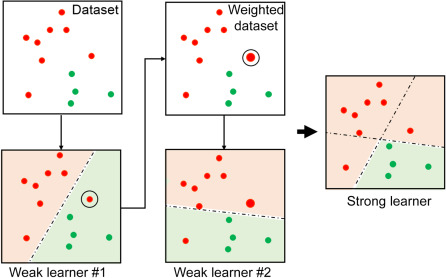
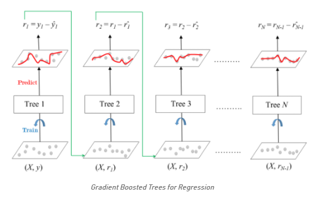
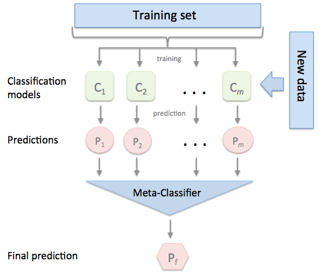

Classificiation
===
## Gradient Boosting Machine
- 여러개의 weak learner를 순차적으로 predcit/eval하며 잘못된 prediction을 수행한 데이터에 weight를 부여해 오류를 개선해 나가는 방식이다.
- Adaboost
    - 오류 데이터에 가중치 부여    
    - 
- gradient boost
    - Adaboost와 유사하나 가중치 업데이트를 할 때 `경사하강법`을 사용한다.
    - 오류값 : 실제 값 - 예측 값
    - 경사하강법
        - **반복 수행을 통해 오류를 최소화할 수 있도록 가중치의 업데이트 값을 도출하는 방법**
    - 

- hyperparameter tuning
    - loss
    - learning rate
    - number of weak learners
    - subsample rate

- Overfitting에 뛰어난 예측 성능을 가진다.
- 수행시간이 오래 걸린다.
---
## XGBoost와 LightGBM
- 트리 기반 앙상블에서 가장 각광받고 있는 알고리즘 들
- CPU 환경에서 병렬처리가 가능하다.
- XGBoost : 기존 GBM보다 빠르지만 여전히 느리다.
- [2_xgboost_example.py](https://github.com/vim-hjk/machine-learning-study/blob/main/ch04/part2/2_xgboost_example.py) 참고
- LightGBM : GBM보다 훨씬 빠르지만 대용량 데이터의 경우 만족할만한 학습 성능을 기대하려면 많은 CPU 코어를 필요로 한다. 
- [3_light_gbm.py](https://github.com/vim-hjk/machine-learning-study/blob/main/ch04/part2/3_light_gbm.py) 참고
---
## Kaggle - Santander Customer Satisfaction
- [데이터 다운로드 링크](https://www.kaggle.com/c/santander-customer-satisfaction/data)
- [4_santander_customer_satisfaction.py](https://github.com/vim-hjk/machine-learning-study/blob/main/ch04/part2/4_santander_customer_satisfaction.py) 참고
---
## Kaggle - Craditcardfraud
- [데이터 다운로드 링크](https://www.kaggle.com/mlg-ulb/creditcardfraud)
- [5_creditcard.py](https://github.com/vim-hjk/machine-learning-study/blob/main/ch04/part2/5_creditcard.py) 참고
---
## Stacking Ensemble
- Stacking : 개별적인 여러 알고리즘을 서로 결합해 예측 결과를 도출한다는 점에서 Bagging, Boosting과 유사함
- 
- 가장 큰 차이점은 개별 알고리즘으로 예측한 데이터를 기반으로 다시 예측을 수행한다는 것
- 개별 알고리즘의 예측 결과 데이터 세트를 최종적인 메타 데이터 세트로 만들어 별도의 ML 알고리즘으로 최종 학습을 수행하고 테스트 데이터를 기반으로 다시 최종 예측을 수행하는 방식
- 개별 모델의 예측된 데이터 세트를 다시 기반으로 하여 학습하고 예측하는 방식을 메타 모델이라고 함
- 두 종류의 모델이 필요
    - 1. 개별적인 기반 모델
    - 2. 개별 기반 모델의 예측 데이터를 학습 데이터로 맏르어서 학습하는 최종 메타 모델
    - Stacking 모델의 핵심은 여러 개별 모델의 예측 데이터를 각각 Stacking 형태로 결합해 최종 메타 모델의 학습용 feature 데이터 세트와 테스트용 feature 데이터 세트를 만드는 것이다.
- 현실 모델에 적용은 많이 안하지만 대회에서 성능을 조금이라도 더 돌리려고 사용하는 방식
- 2, 3개의 개별 모델가지고는 힘들고 많은 개별 모델이 필요하다.
- 한다고 무조건 성능이 향상된다는 보장도 없다.
---
## Reference
- https://www.sciencedirect.com/topics/engineering/adaboost
- https://www.geeksforgeeks.org/ml-gradient-boosting/
- http://rasbt.github.io/mlxtend/user_guide/classifier/StackingClassifier/

