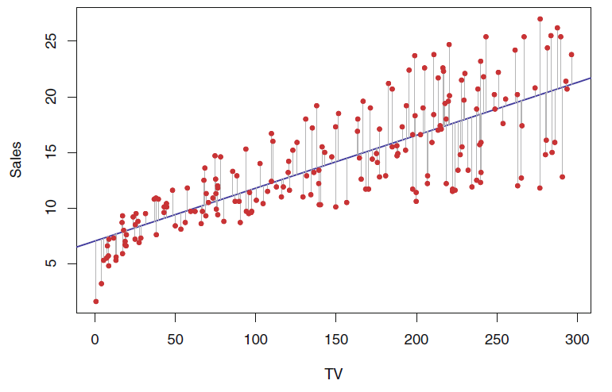
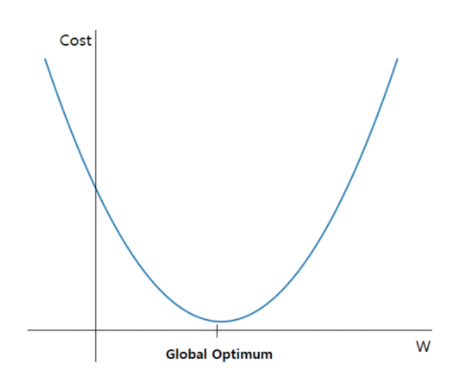
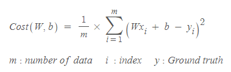
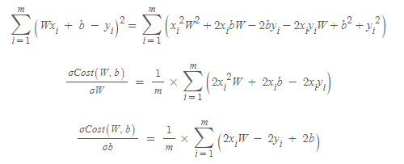
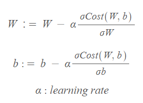

Regression 
== 
## 회귀
- 데이터 값이 평균과 같은 일정한 값으로 돌아가려는 경향을 이용한 통계학 기법
- 여러 개의 독립변수와 한 개의 종속변수 간의 상관관계를 모델링하는 기법
- 주어진 특징과 결정 값 데이터 기반에서 학습을 통해 **최적의 회귀 계수**를 찾아내는 것이다.
- 회귀 계수가 선형이냐 비선형이냐 에 따라 선형 회귀와 비선형 회귀로 나뉨
- 독립변수가 1개인지 여러 개인지에 따라서 단일 회귀, 다중 회귀로 나뉨

- Linear Regression
    - 실제 값과 예측값의 차이를 최소화하는 직선형 회귀선을 최적화하는 방식
    - Regularization 방법에 따라서 다시 여러 종류로 나뉨
    - 종류
        - 일반 선형 회귀
        - Ridge
        - Lasso
        - ElasticNet
        - Logistic Regression
---
## 선형회귀와 경사하강법
- 일반 선형 회귀
    - `예측값과 실제 값의 Residual Sum of Squares를 최소화할 수 있도록 회귀 계수를 최적화하며 Regularization을 적용하지 않은 모델`
    
    - RSS는 Cost이며 w 변수로 구성되는 RSS를 loss function이라고 한다.
    
    - loss를 최소화시키는 것이 목적이다.

- 경사 하강법
    - 어떻게 하면 오류가 작아지는 방향으로 W값을 보정할 수 있는지를 목적으로 삼음
    
    
    - 편미분을 사용함
    - 기울기가 감소하지 않는 지점을 global optimum으로 삼고 그 때의 w를 반환한다.
---    
## 보스턴 주택 가격 회귀 구현
- [2_predict_boston.py](https://github.com/vim-hjk/machine-learning-study/blob/main/ch05/part1/2_predict_boston.py) 참고

---
## Reference
- https://godongyoung.github.io/%EB%A8%B8%EC%8B%A0%EB%9F%AC%EB%8B%9D/2018/01/20/ISL-linear-regression_ch3.html
- https://blog.naver.com/dr_moms/221602408008
- https://www.youtube.com/watch?v=ve6gtpZV83E