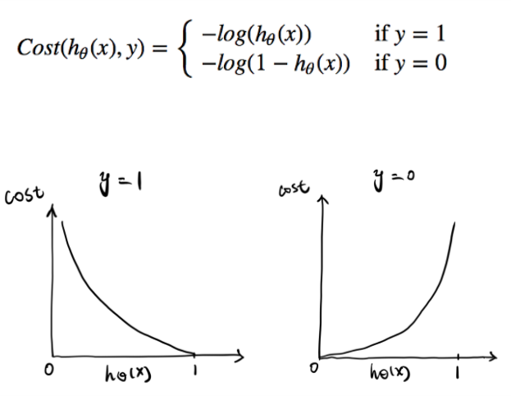

Regression Part2
== 
## 선형 회귀와 다항회귀
- 선형 회귀 : 독립변수(feature)와 종속변수(target)의 관계가 일차 방정식 형태로 표현된 회귀
- 다항 회귀 : 독립변수의 단항식이 아닌 2차, 3차 방정식과 같은 다항식으로 표현된 회귀
- 다항 회귀를 비선형 회귀로 혼동하기 쉽지만, 다항 회귀는 **선형 회귀**이다.
- **회귀에서 선형 회귀/비선형 회귀를 나누는 기준은 회귀 계수가 선형/비선형인지에 따른 것이지 독립변수의 선형/비선형 여부와는 무관하다.**
- 회귀 계수가 선형이냐 비선형이냐 에 따라 선형 회귀와 비선형 회귀로 나뉨
- 
---
## 다항 회귀를 이용한 과소적합 및 과적합 이해
- 다항 회귀는 feature의 직선적 관계가 아닌 복잡한 다항 관계를 모델링 할 수 있다.
- 차수(degree)가 높아질수록 매우 복잡한 피처 간의 관계까지 모델링이 가능하지만, 차수를 높일수록 학습 데이터에만 너무 맞춘 학습이 이루어져 테스트 환경에서는 오히려 예측 정확도가 떨어진다.
- 
---
## Regularization Linear Model
- Degree가 높은 경우 지나치게 모든 데이터에 적합한 회귀식을 만들기 위해서 다항식이 복잡해지고 회귀 계수가 매우 크게 설정이 되면서 평가 데이터 세트에 대해서 형편 없는 성능을 보인다.
- 회귀 모델은 적절히 데이터에 적합하면서도 회귀 계수가 기하급수적으로 커지는 것을 제어할 수 있어야 한다.
- 이전까지 선형 모델의 비용함수는 실제 값과 예측 값의 차이(RSS)를 최소화하는 것만 고려했지만, 위의 문제를 해결하기 위해 회귀계수 크기를 제어하여 학습과 과적합 사이의 균형을 이루는 것이 중요하다.
- 릿지 회귀
    - L2 Regularization term을 사용하는 다항 회귀
    - `Weight Decay`
    - Local noise가 학습에 큰 영향을 끼치지 않는다는 것을 의미하며, outlier의 영향을 적게 받도록 하고 싶다.
- 라쏘 회귀
    - L1 Regularization term을 사용하는 다항 회귀
    - Weight 값 자체를 줄이는 것이 아니라 weight 업데이트 시 `특정 상수 값을  계속해서 빼는 방식`
    - 어떤 특정 weight를 𝑤_𝑖라고 할 때, 불필요한 𝑤_𝑖를 급격하게 감소시켜 0으로 만들고 제거한다. (feature selection)
- 엘라스틱 넷 회귀
    - L2 + L1 Regularization
    - Lasso regression이 서로 상관관계가 높은 feature들의 경우에 이들 중에서 중요 feature만을 선택하고 다른 feature들은 모두 회귀 계수를 0으로 만드는 성향이 강한 것을 완화하기 위해 L2 regularization term을 추가한 것이다.
    - 학습 수행시간이 상대적으로 오래 걸린다.
- L2 Regularization vs L1 Regularization
    - 
    - RSS는 Cost이며 w 변수로 구성되는 RSS를 loss function이라고 한다.
    - 녹색 : L2 norm, 나머지 : L1 norm
    - L2 norm은 각각의 벡터에 대해 항상 Unique 한 값을 내지만, L1 norm은 경우에 따라 특정 feature vector 없이도 같은 값을 낼 수 있다.
    - 예를 들어 L1 norm은 파란색 선 대신 빨간색 선을 사용하여 특정 feature를 0으로 처리하는 것이 가능하다. (feature selection)
- 로지스틱 회귀
    - 선형 회귀 방식을 분류에 적용한 알고리즘
    - 선형 회귀와의 차이점 : 학습을 통해 선형 함수의 회귀 최적선을 찾는 것이 아니라 sigmoid 함수 최적선을 찾고 이 sigmoid 함수의 반환 값을 확률로 간주해 확률에 따라 분류를 결정
    - 
    - 선형 회귀에서 사용했던 비용함수를 사용하면 결과가 non-convex(wavy)하게 나온다. 결국 global optima를 찾기 어렵다.
    - 
---
## 회귀 트리
- 회귀를 위한 트리를 생성하고 이를 기반으로 회귀 예측을 수행한다.
- 리프 노드에서 예측 결정 값을 만드는 과정에서 차이가 있다. 분류 트리가 특정 클래스 레이블을 결정하는 것과는 달리 리프 노드에 속한 데이터 값의 평균값을 구해 회귀 예측값을 계산한다.
- 모든 트리 기반의 알고리즘은 분류 뿐만 아니라 회귀도 가능하다.
- 
---    
## kaggle - bike sharing demand
- [9_bike_sharing_demand](https://github.com/vim-hjk/machine-learning-study/blob/main/ch05/part2/9_bike_sharing_demand.py) 참고
---
## kaggle - house prices
- [q10_house_prices](https://github.com/vim-hjk/machine-learning-study/blob/main/ch05/part2/q10_house_prices.py) 참고