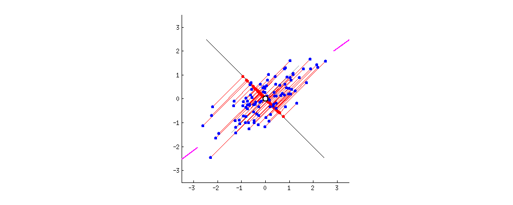
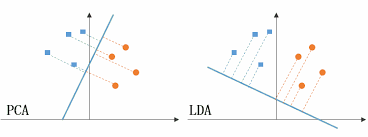
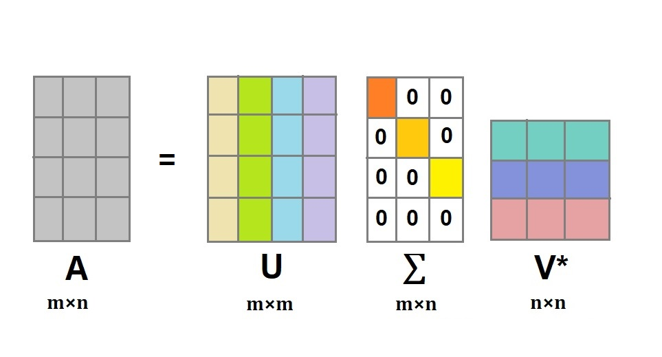
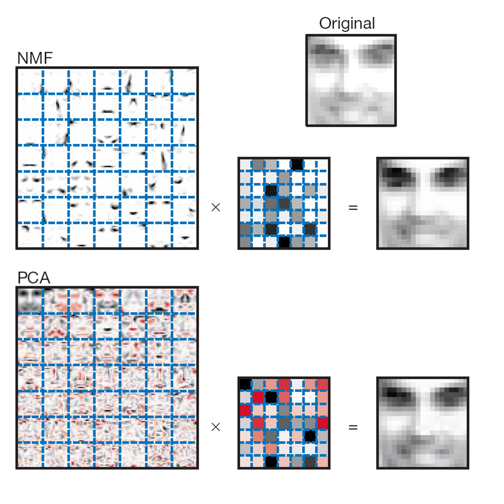

차원 축소
== 
## Dimension Reductinon
- 일반적으로 차원이 증가할수록 데이터 포인트 간의 거리가 기하급수적으로 멀어지게 되고 sparse한 구조를 가지게 된다.
- 상대적으로 적은 차원에서 학습된 모델보다 예측 신뢰도가 떨어진다. 또한 feature가 많을 경우 개별 feature간의 상관관계가 커진다.
- feature selection
    - 특정 feature에 종속성이 강한 불필요한 feature는 아예 제거한다.
    - 특징을 잘 나타내는 feature만 선택    
- feature extraction
    - 기존 feature를 저차원의 중요 feature로 압축해서 추출하는 것
    - 단순 압축이 아니라, 함축적으로 더 잘 설명할 수 있는 또 다른 공간으로 mapping해 추출하는 것
    - **Latent Factor 추출**
- 차원 축소 알고리즘
    - PCA
    - SVD
    - NMF
- 데이터 타입에 따른 차원 축소 알고리즘의 효과
    - 이미지
        - 잠재된 특성을 feature로 도출해 함축적 형태의 이미지 변환과 압축을 수행할 수 있다.
        - 원본 이미지보다 적은 차원이기 때문에 overfitting 영향력이 작아져서 오히려 원본 데이터로 예측하는 것보다 예측성능을 끌어올릴 수 있다.
    - 텍스트
        - 문서의 숨겨진 의미를 추출
        - 문서 내 단어들의 구성에서 숨격져 있는 semantic 의미나 topic을 잠재 요소로 간주하고 이를 찾아낼 수 있다. -> (SVD, NMF)
---
## Principal Component Analysis
- 대표적인 차원 축소 기법
- 주성분을 추출해 차원을 축소하는 기법
- **기존 데이터의 정보 유실이 최소화된다.**
- `가장 높은 분산을 가지는 데이터의 축을 찾아 이 축으로 차원을 축소하는데, 이것이 PCA의 주성분이다.`
- 데이터 변동성이 가장 큰 방향으로 축을 생성하고, 새롭게 생성된 축으로 데이터를 투영하는 방식
- 가장 큰 데이터 변동성(Variance)을 기반으로 첫 번째 벡터 축을 생성하고, 두 번째 축은 이 벡터 축에 직각이 되는 벡터(직교 벡터)를 축으로 한다.
- 세 번째 축은 다시 두 번째 축과 직각이 되는 벡터를 설정하는 방식으로 축을 생성한다.
- 생성된 벡터 축에 원본 데이터를 투영하면 벡터 축의 개수만큼의 차원으로 원본 데이터가 차원 축소된다.
- **원본 데이터의 feature 개수에 비해 매우 작은 주성분으로 원본 데이터의 총 변동성을 대부분 설명할 수 있는 분석기법**
- 입력 데이터의 Covariance Matrix에서 eigen vector를 찾고, 입력 데이터를 linear transform하는 것이다.
- eigen vector가 PCA의 주성분 vector로서 입력 데이터의 분산이 큰 방향을 나타낸다.
- Covariance Matrix는 Diagonal이며, Symmetric하다.
- **`입력 데이터의 Covariance Matrix가 eigen vector와 eigen value로 분해될 수 있으며, 이렇게 분해된 eigen vector를 이용해 입력 데이터를 linear transform하는 방식이 PCA이다.`**
- 
---
## Linear Discriminant Analysis
- 선형 판별 분석법으로 PCA와 매우 유사하다.
- 차이점은 Classification에서 사용하기 쉽도록 개별 class를 분별할 수 있는 기준을 최대한 유지하면서 차원을 축소한다.
- PCA가 입력 데이터의 변동성의 가장 큰 축을 찾았다면, 입력 데이터의 결정 값 class를 최대한으로 분리할 수 있는 축을 찾는다.
- 특정 공간상에서 class 분리를 최대화하는 축을 찾기 위해 class 간 분산(between-class scatter)과 class 내부 분산(within-class scatter)의 비율을 최대화하는 방식으로 차원을 축소한다. 
- **class 간 분산은 최대한 크게 가져가고, class 내부 분산은 최대한 작게 가져가는 기법**
- 
---
## Singular Value Decomposition
- Sqare Matrix가 아니라 다른 Matrix에서도 행렬 분해를 수행하는 기법
- 특이값 분해
- 모든 singular vector는 서로 직교하는 성질을 갖는다는 것을 이용한다.
- Truncated SVD
    - 대각 원소 중에 상위 몇 개만 추출해서 여기에 대응하는 U와 V의 원소도 함께 제거해 더욱 차원을 줄인 형태로 분해하는 것이다.    
- 
---    
## Non-Negative Matrix Factorization
- Truncated SVD와 같이 낮은 rank를 통한 Low-Rank Approximation 방식의 변형이다.
- 원본 Matrix 내의 모든 원소 값이 모두 양수라는게 보장되면 간단하게 두 개의 기반 양수 행렬로 분해될 수 있는 기법이다.
- 패턴인식, 텍스트의 topic modeling, 문서 유사도 및 클러스터링에 자주 사용된다.
- 
