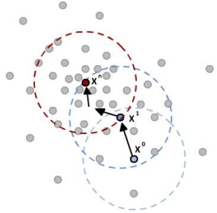

군집화
== 
## Understanding K-means Algorithm
- K-means Clustering에서 가장 일반적으로 사용되는 알고리즘
- K-means Clustering
    - centroid라는 특정한 임의의 지점을 선택해 해당 중심에 가장 가까운 포인트들을 선택하는 군집화 기법
    - 쉽고 간결하지만 거리 기반 알고리즘으로 속성의 개수가 매우 많을 경우 군집화 정확도가 떨어진다.(이 때, PCA를 활용한다.)
    - 반복을 수행하는데 반복 횟수가 많을 수록 실행시간이 매우 느리며, 몇 개의 군집을 선택해야할 지 결정하기 어렵다.
- 
---
## Cluster Evaluation
- 군집화가 얼마나 효율적으로 됐는지 판단하기 어렵다.
- **데이터 내에 숨어 있는 별도의 그룹을 찾아서 의미를 부여하거나 동일한 분류 값에 속하더라도 그 안에서 더 세분화된 군집화를 추구하거나 서로 다른 분류 값의 데이터도 더 넓은 군집화 레벨화 등의 영역을 가지고 있기 때문이다.**
- Silhouette Analysis
    - 각 군집간의 거리가 얼마나 효율적으로 분리됐는지 나타내는 지표
    - 효율적 분리란? : 다른 군집과의 거리는 떨어져 있고 동일 군집끼리의 데이터는 서로 가깝게 잘 뭉쳐 있다는 의미
    - silhouette coefficient를 기반으로 개별 데이터가 가지는 군집화 지표이다.
    - 해당 데이터가 같은 군집 내의 데이터와 얼마나 가깝게 군집화돼 있고, 다른 군집에 있는 데이터와는 얼마나 멀리 분리돼 있는지를 나타내는 지표    
    - mean silhouette coefficient 값이 높다고 해서 반드시 최적의 군집 개수로 군집화가 잘 됐다고 볼 수는 없다.
        - 특정 군집내의 값만 너무 높고 다른 군집은 내부 데이터끼리의 거리가 너무 떨어져 있어 silhouette coefficient값이 낮아져도 평균적으로 높은 값을 가질 수 있따.
        - **개별 군집별로 적당히 분리된 거리를 유지하면서도 군집 내의 데이터가 서로 뭉쳐 있는 경우가 목표로 하는 바이다.**
        - 데이터 시각화를 통한 최적화가 필요하다.        
    
- 
---
## Mean Shift
- 중심을 군집의 중심으로 지속적으로 움직이면서 군집화를 수행하는 기법이다.
- 중심을 데이터가 모여 있는 밀도가 가장 높은 곳으로 이동한다.
- Probability Density Function, Kernel Density Estimation을 이용한다.
- 특정 데이터 내의 데이터 분포 확률 밀도가 가장 높은 곳으로 이동하기 위해 주변 데이터와의 거리값을 KDE function 값으로 입력한 뒤 그 반환 값을 현재 위치에서 업데이트 하면서 이동하는 방식이다.
- `지나치게 단순화된 방식으로 under-fitting되기 쉬우므로 적절한 KDE bandwidth h를 계산하는 것이 매우 매우 중요하다.`
- **군집의 개수를 지정하지 않으며, 오직 bandwidth의 크기에 따라 군집화를 수행한다.**
- 